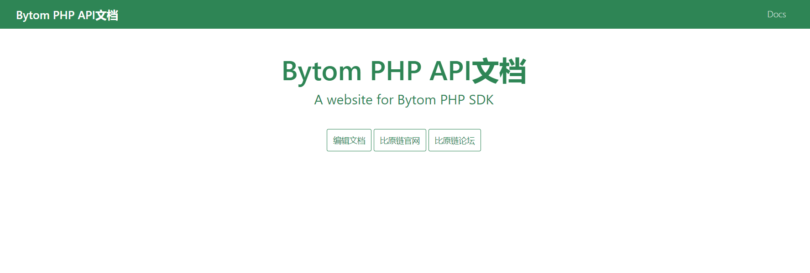

# BytomPHP.github.io

此文档介绍了包含[bytom php sdk](<https://github.com/lxlxw/bytom-php-sdk.git>)提供支持的网站配置和文档。

## 入门

### 准备

1. 确保您安装了 [Node](https://nodejs.org/en/download/) （需要8.0或更高的版本）.

   > 如果您没有安装 Node 8.2 + ，或是您希望在全局范围内安装 Docusaurus，请运行 `yarn global add docusaurus-init` 或 `npm install --global docusaurus-init`。 安装完成后，运行 `docusaurus-init`。

2. 我们同样建议您也安装 [Yarn](https://yarnpkg.com/en/docs/install) （需要1.5或更高的版本）.

3. 在github上clone项目到本地文件夹，项目中包含两个文件夹： `docs` and `website`.

```bash
git clone https://github.com/BytomFans/php-docs
```

### 安装

在根目下运行：

1. `cd website`进入站点的网页部分.
2. `yarn` 安装网页的依赖库 (或者使用命令 `npm install`).

### 本地运行

1. `使用命令 `yarn start` or `npm start`运行网站.
2. 如果没有自动打开本地的示例网站，请在 [http://localhost:3000](http://localhost:3000/) 访问站点.



### 概述

如果您希望对文档进行编辑或添加，那么您可以查看`docs/`目录。如果您想要编辑站点构建方式的内部结构，本机战点是使用docusaurus生成的静态网站，因此您需要熟悉站点的构建方式。网站配置可以在`website/`目录中找到，您可以访问[docusaurus网站](<https://docusaurus.io/docs/zh-CN/installation>)了解有关所有可用配置选项的更多信息。

### 目录结构

```bash
root-directory
│  .dockerignore
│  .gitignore
│  docker-compose.yml
│  Dockerfile
│  README.md
│
├─docs
│      0_start.md
│      10_work.md
│      11_message.md
│      12_feed.md
│      13_net-info.md
│      14_decode_program.md
│      15_other.md
│      16_build.md
│      17_ explanation.md
│      1_key.md
│      2_account.md
│      3_asset.md
│      4_transaction.md
│      5_wallet.md
│      6_access_token.md
│      7_block.md
│      8_mining.md
│      9_gas.md
│
└─website
    │  package.json
    │  sidebars.json
    │  siteConfig.js
    │
    ├─core
    │      Footer.js
    │
    ├─pages
    │  └─en
    │          help.js
    │          index.js
    │          users.js
    │
    └─static
        ├─css
        │      custom.css
        │
        └─img
            │  docusaurus.svg
            │  oss_logo.png
            │
            └─favicon
                    favicon.ico
```

### 创建分支

1. `git checkout master`在本地项目根目录

2. `git pull origin master`保持代码最新
3. `git checkout -b the-name-of-my-branch`（the-name-of-my-branch替换成自定义的分支名）

### 发布到Github Pages

1. 在项目根目录打开命令行，进入`website/`

```bash
cd website
```

2. 确保您输入的`GIT_USER`有权限提交分支，运行脚本

```bash
GIT_USER=<GIT_USER> \
  CURRENT_BRANCH=master \
  USE_SSH=true \
  yarn run publish-gh-pages # or `npm run publish-gh-pages`
```

### 访问网站

在您的github项目setting里选择Github Pages显示的分支。